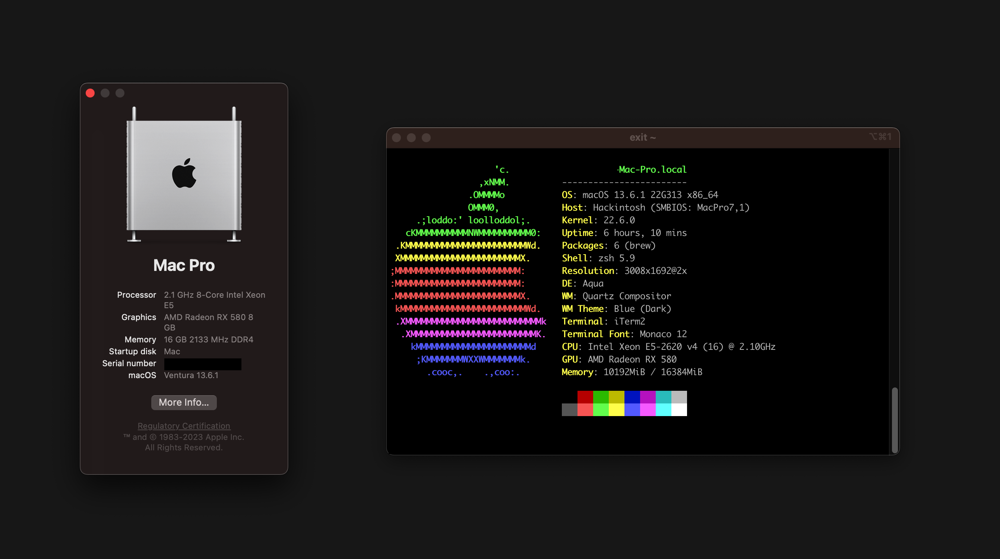
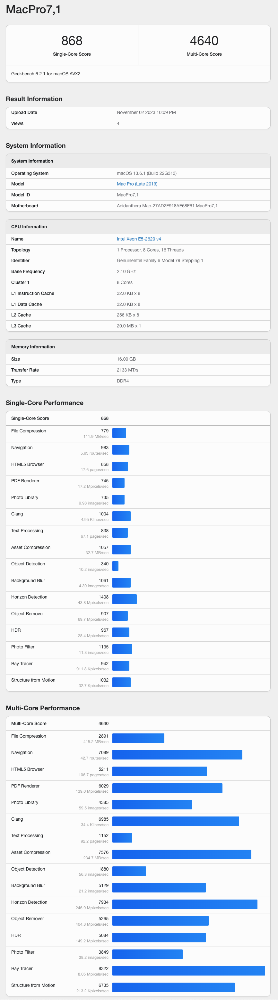
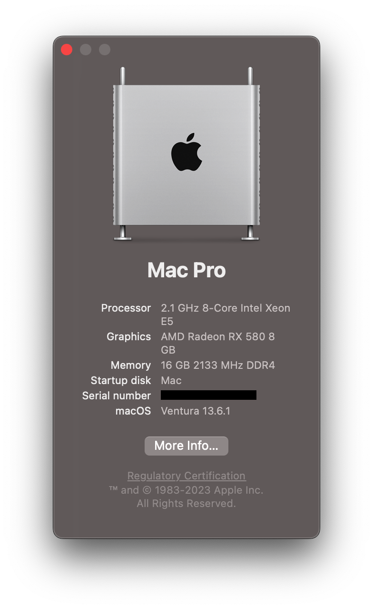
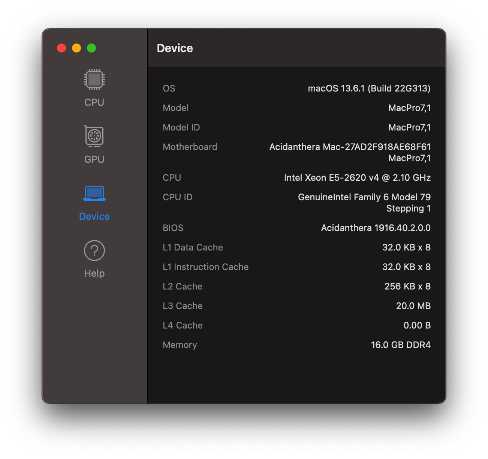

#  Lenovo P520 X99 Hackintosh

Hey there, enthusiasts! 🌟 Step into my virtual realm, where we'll embark on an exhilarating journey through the intricacies of my customized EFI configuration for the Lenovo P520, part of my bespoke computer build. 🖥️

What's the scoop, you ask? I've achieved an awe-inspiring feat – Ventura now thrives on the P520!!

And brace yourselves for the pièce de résistance: the avant-garde Opencore 0.9.4! 🚀 Delve into its brilliance on Opencore's official hub.

[Opencore 0.9.4](https://github.com/acidanthera/OpenCorePkg)

"Alright, listen up, my fellow knowledge seekers! 🌟 Let me spill the beans: I'm dishing out my hard-earned wisdom straight from the trenches of my own experiences. Plus, I've leaned on Dortania's Doc, the oracle of expertise, for some top-tier advice. Because, as they say, teamwork makes the dream work, am I right?

But here's a nifty tidbit for you – if your BIOS is feeling a tad antiquated, why not treat it to a little makeover? Head on over to the official support page for a rejuvenating upgrade. It's like sending your trusty computer on a well-deserved spa day! 💆‍♂️💆‍♀️

And worry not, my friends, for I've stashed a few secrets in there (we're talking Serial Numbers, MLB, ROM... shhh!). Just remember to tinker with your Config.plist to keep those gems on the hush-hush. 🤫💻✨"

  

## GEEKBENCH RESULTS

  

## THE BUILD

  

* **CPU:** Intel(R) Xeon(R) CPU E5-2620 v4 @ 2.10GHz
* **Motherboard:** Lenovo OME
* **Memory:** Samsung LRDIMM 2x 8GB DDR4 ECC 2133MHZ
* **Storage (macOS):** x1 PCI SSD 512GB
* **GPU:** Radeon RX 580 8GB (No Graphic issues at all, nice for Graphic Acceleration 🚀 )
* **Power Supply:** [Lenovo OEM 650W](https://www.lenovo.com/medias/ThinkStation-P510-Datasheet-November-2016.pdf?context=bWFzdGVyfHJvb3R8OTYwOTUyfGFwcGxpY2F0aW9uL3BkZnxoODEvaDllLzk0NTk1NDYyNTk0ODYucGRmfDFjYTU0NzI1NjJkM2VlMTg2NmMwMTBjZjNjYjdlNWQxZTg0OTQ0YjI2MWZiYzgwNGY2NWVmNGQ3ZTdiNmFjZTI)
* **Case:** Lenovo OEM
* **Audio:** Realtek ALC662

  

## UEFI SETTING

* Serial Port : `Disabled`
* CSM Support: `Enabled`
* BootOption: `UEFI and Legacy`
* XHCI/EHCI Hand-off: `Enabled`
* VTD: `Disabled`
* Intel VT: `Enabled`
* Secure boot: `Disabled`
* Fast boot: `Disabled`

## Kexts used:

- [x] AppleALC.kext
- [x] BlueToolFixup.kext
- [x] GenericCardReaderFriend.kext
- [x] IntelMausi.kext
- [x] Lilu.kext
- [x] NVMeFix.kext
- [x] RestrictEvents.kext
- [x] RTCMemoryFixup.kext
- [x] SMCProcessor.kext
- [x] I SMCSuperIO.kext
- [x] USBPower.kext
- [x] VirtualSMC.kext
- [x] WhateverGreen.kext

## TOOLS USED

> ### [GenSMBIOS](https://github.com/corpnewt/GenSMBIOS) to generate System Serial Number and System UUID etc.

> ### [MountEFI](https://github.com/corpnewt/MountEFI) to mount the EFI partition

> ### [SSDTTime](https://github.com/corpnewt/SSDTTime) to dump DSDTs and create SSDTs

> ### [ProperTree](https://github.com/corpnewt/ProperTree) a very nice GUI plist editor

## MISCELLANEOUS

So, here's the deal, my fellow tech adventurer! 🛠️ I followed the wonderful [Dortania's OpenCore Install Guide](https://dortania.github.io/OpenCore-Install-Guide/) as my trusty roadmap on this exciting journey.

But here's where the excitement kicks in – your setup could be as one-of-a-kind as a majestic unicorn, thanks to the diverse array of components nestled inside. 🦄 So, it's time to let your individuality shine, and you've got to groove to the beat of the guide in your own distinct way. Think of it like jazz – a little improvisation is the secret ingredient that makes your system truly sing!" 🎷🎶🎵

My CPU is a cool cat, the Haswell E, and I zeroed in on [this PART of the guide](https://dortania.github.io/Getting-Started-With-ACPI/ssdt-methods/ssdt-prebuilt.html#haswell-and-broadwell-e). You could take the easy route with Prebuilt SSDTs, but that might make your system boot slower than a snail on a hot day because of all the bloats. 🐌 I'd recommend getting your hands dirty (compiling and decompiling) or using a slick automated tool like SSDTTime.

Oh, and here's a golden rule – always give your system a 'Clean Snapshot' (Cmd+Shift+R) with Propertree after any changes in the EFI folder. It's like taking a selfie after a new haircut, just to make sure you're looking your best! 📸💇‍♂️💇‍♀️

## SETTING UP OPENCORE GUI

Fancy a little style upgrade for your Opencore setup? 🌟 I'm here to spill the beans on how you can make it look as sleek as a sports car!

First things first, Opencore is all about performance, but that doesn't mean it can't look dapper too. Themes are your new best friend, and you can dive into the world of aesthetics right here: [THEMES ARE FULLY SUPPORTED.](https://dortania.github.io/OpenCore-Post-Install/cosmetic/gui.html#setting-up-opencore-s-gui) 

Now, let's talk about the star of the show – The `Antebellum` theme. 🎩 You can grab it from the treasure chest over at Antebellum Theme. It's like giving your Opencore a snazzy new outfit for a night on the town! https://github.com/canemdormienti/Opencore-Opencanopy-Themes/tree/main/Antebellum

But, of course, there are always a few tweaks to make it shine. Just like fine-tuning a sports car to get the best performance, you'll need to make a few adjustments for everything to work like a charm. 🏎️✨

So, get ready to turn heads with your Opencore setup – it's time to make it look as sharp as a tack! 💼🌆💃

> - Add `OpenCanopy.efi` to `EFI/OC/Drivers`
> - In `Misc`, change -> Boot -> PickerMode: `External` 
> - In `Misc`, change -> Boot -> PickerAttributes: `144`
> - In `Misc`, change -> Boot -> Pickervariant: `canemdormienti\Antebellum`

I have it included in my EFI folder if you want to use that.

## CREDITS

- All thanks to the [Dortania Team](https://dortania.github.io/OpenCore-Install-Guide/misc/credit.html) for their incredible work.

- Thanks to the incredible community of [/r/hackintosh/](https://www.reddit.com/r/hackintosh/)

